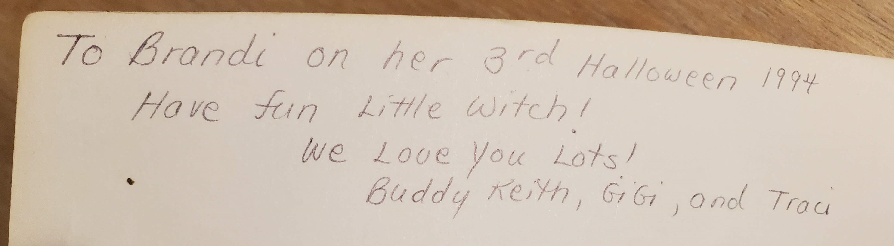
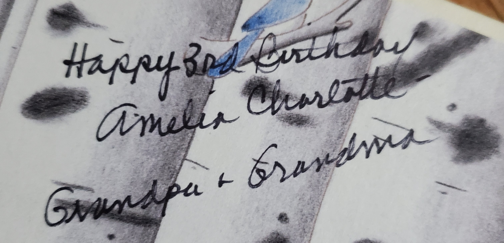

---
---

# Books, Thrifting, Love and Death

My wife and I love to go shopping at thrift stored. While she looks at clothes, I'll typically spend at least part of my time looking at books. We've gotten a lot of books that have very sweet and touching messages: As you can imagine, a lot of these books were birthday or Christmas presents originally. 

Sometimes it can be sad to think about what led to the book being discarded: Do the gift-receiver and gift-giver still see each other? In a lot of cases, where a grandparent has written a very sweet note decades ago, they may have died since. 

However, I also think it's very nice that we can at least look at these messages all these years later, and appreciate the thought and care that went into the gift. All we can see is this brief moment of time in a relationship we otherwise know nothing about.

We thought it would be nice to release pictures of these books and messages into the ocean of the Internet. Maybe the person who received or gave the book can happen upon a picture, and have some small satisfaction of a gift received years ago.

For each book, I'll include the following:

 - An image of the cover and actual note
 - A transcription of the note
 - Some additional notes of my own

## Make Way for Ducklings 
by Robert McCloskey

> 10/2014
> 
> Drayton [sp?]
> 
> In October, 2014 Pop and I went to Boston, Massachusetts with friends. It's a very old city and has so many wonderful places to visit&mdash;the USS Constitution, the site of the Boston Tea Party, Harvard and MIT, and a beautiful large park called Boston Commons. The writer of this book lived in Boston and wrote this story about a momma and daddy duck who made a home for their 8 ducklings in that park. Pop and I saw the bronze statues of Mr. and Mrs. Mallard and their 8 babies. I hope you'll enjoy the book and will get a chance to see Boston and the ducks some day.
> 
> Love you, Mimi

I myself have always enjoyed this book, along with Robert McCloskey's books. When I was a kid, we had one of those Scholastic VHS tapes with read-alouds of some of his books, including this one. Now I can enjoy reading these stories to my daughter. 

I sure hope Drayton had a chance to get up to Boston at some point. 

## The True Story of the 3 Little Pigs 
by Jon Scieszka and Lane Smith

> 1991
> 
> To Andy,
> 
> Merry Christmas!
> 
> With all my love!
> 
> Aunt Patsy

I remember reading this book as a kid, and agreeing with the wolf. Re-reading it now, as an adult, the wolf comes across  as sort of sleazy and untrustworthy.

## Little Witch's Big Night
By Deborah Hautzig; Illustrated by Marc Brown

> To Brandi on her 3rd Halloween 1994
> 
> Have fun little witch!
> 
> We love you lots!
> 
> Buddy, Keight, GiGi and Traci

I hope Brandi had fun on her _32nd_ Halloween.

## Maybelle

by Virginia Lee Burton

> Dear Julia
> 
> Hope you will enjoy "Maybelle" as much as my [...] always did. We read her story every day. Perhaps one day your parents will take you to San Franciso and you can ride "Maybelle". She's still there. 
> 
> Enjoy&mdash;
> 
> Susan Shields [sp?]

The [Wikipedia page on the San Francisco cable car system](https://en.wikipedia.org/wiki/San_Francisco_cable_car_system) has more information on the history of the cable cars.

## Puss in Boots

By Charles Perrault; Illustrated by Fred Marcellino

> Merry Christmas Ellie
> 
> from Mamma and Daddy
> 
> 1990

## Tea Party Rules

By Ame Dyckman; Illustrated by K. G. Campbell

> Happy 3rd Birthday, Amelia Charlotte&mdash;
> 
> Grandpa and Grandma

This is a delightful book about a bear that is willing to put up with a lot to get some cookies.

## The Wind in the Willows

By Kenneth Grahame; Illustrated by Robert J. Lee

> Jennifer Strobel
> 
> Please return if found

Well, Jennifer Strobel. I have your book. But I don't know where to send it.

## Zen Shorts

By Jon J Muth

> December 2015
> 
> Happy Birthday Chase!
> 
> Chase, this book has 3 stories. The author uses these stories to tell us things that are quite important. They make us think kind thoughts and how to be loving.
> 
> Chase, you are a very special boy who is kind too. Thank you for showing us your loving heart!
> 
> XO Meme and Papa